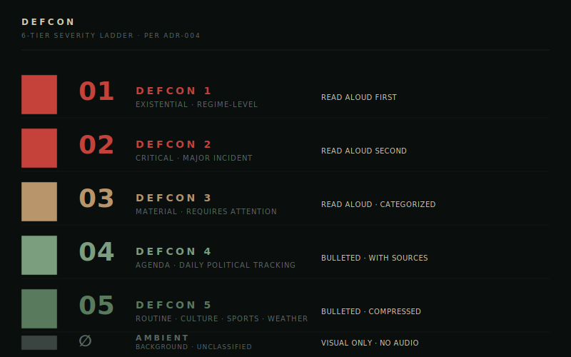
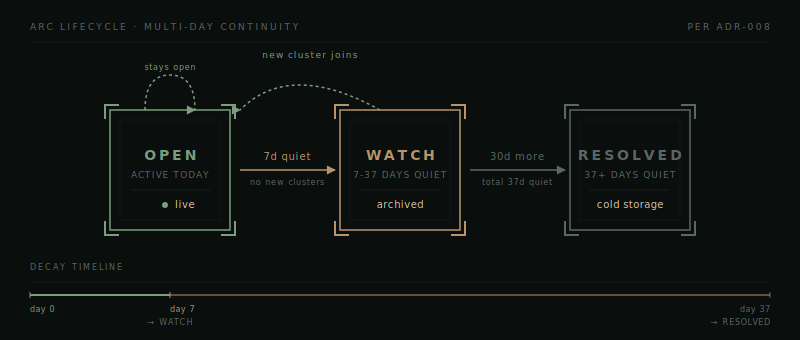
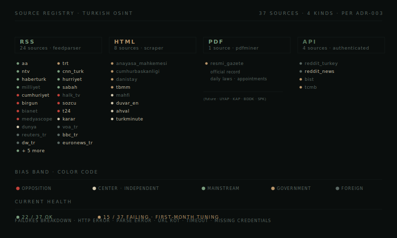

 

**A personal OSINT briefing system for Turkey · runs nightly on one laptop · produces a Turkish-language brief with synthesized audio every morning at 07:00.**

 

 

## ❯ What is this

MÜŞAHİT is a single-laptop system that watches Turkey overnight and tells you what mattered by the time you wake up. It polls 37 Turkish news sources between 01:00 and 07:00 local time, clusters related stories together, classifies their severity on a six-tier DEFCON ladder, tracks multi-day story arcs, writes a structured Turkish-language briefing, and synthesizes the briefing as audio. You open the laptop in the morning. You read or listen.

The name means *witness · observer* in Turkish, from Arabic مشاهد. The project is named after what it does.

 

## ❯ Why this exists

Turkish news moves fast and the signal-to-noise ratio is hard. Mainstream outlets compete on speed, not depth. Opposition outlets cover what mainstream skips, but their political framing shapes what makes the cut. Government outlets do the inverse. Foreign coverage filters Turkey through whatever frame the foreign desk uses that week. Nobody publishes a daily synthesis. Even if they did, the synthesis would have a slant.

The premise of MÜŞAHİT is that an OSINT system, given enough sources across enough bias bands, can surface what actually happened by triangulating across them · not perfectly, but better than reading any one outlet. The system is opinionated about severity (DEFCON 1 means existential, DEFCON 5 means routine) and opinionated about what gets read aloud (DEFCON 3 and above) versus what gets bulleted. The system has no opinion about what's true. It cites multiple sources for every claim.

This is a *personal* system. One operator. One laptop. Not a product. Not a service. The intent is to be useful to the person who built it, with discipline tight enough that the system could be useful to others reading it.

 

## ❯ How it works

Seven stages, run in sequence by an orchestrator. Each stage owns one concern. Failures in any single source, model, or stage are contained · the briefing still ships through deterministic fallbacks.

**`01 · INGEST`** · A poller fetches from 37 sources concurrently with per-kind ingesters (RSS via feedparser, HTML via custom scrapers, PDF via pdfminer for Resmî Gazete, API for Reddit and select endpoints). Per-source timeouts. Per-source failure isolation. Articles land in `raw_articles` with provenance.

**`02 · NORMALIZE`** · Deduplicates by URL canonicalization and content hash. Strips HTML cruft. Extracts publication dates, normalizes timezones to UTC. Articles land in `articles` clean.

**`03 · CLUSTER`** · Embeds article headlines with bge-m3 (multilingual, 1024d). Clusters by cosine similarity above a tuned threshold. Each cluster is a candidate "story" · a group of articles from different sources describing the same event.

**`04 · SCORE`** · The slow stage. Qwen2.5-7B reads each cluster's headlines and assigns a DEFCON tier and a category (POLİTİKA, EKONOMİ, GÜVENLİK, DİPLOMASİ, YARGI, MEVZUAT, TOPLUM, SINIFLANDIRILMADI). Validation is strict · invalid outputs trigger retries with feedback, then deterministic fallback.

**`05 · ARC-LINK`** · Today's clusters are matched against the last 30 days of open arcs via cosine similarity. Joined arcs continue. Unmatched clusters seed new arcs. Closed arcs (no new clusters for 7+ days) transition through a state machine documented below.

**`06 · WRITE`** · The Trendyol writer LLM is prompted with a structured template (eight sections, exact markers per ADR-009). Four retry attempts with validator feedback. On failure, the deterministic fallback writer takes over · structurally correct, mechanically written, always ships.

**`07 · TTS`** · The "Öne Çıkanlar" section (top 10 voiced arcs) gets synthesized via Piper TTS using a Turkish voice (tr_TR-dfki-medium). Chunked at section boundaries with per-chunk resilience · a single failure doesn't kill the audio.

A `pipeline_runs` row tracks lifecycle. A `try/finally` in the orchestrator guarantees terminal status. Stuck-at-RUNNING states auto-recover. Resume logic skips already-completed stages. The system is designed to be killed and restarted at any point.

 

## ❯ The DEFCON ladder

Every cluster gets classified on this six-level scale. The classification determines what happens to the story in the briefing.

The scale is **calibrated to be parsimonious**. DEFCON 1 should be rare · regime-level events, war declarations, constitutional crises. DEFCON 2 should be reserved for major incidents with cascading consequences. Most days have neither. Most clusters land at DEFCON 4 or 5. This is the point · a properly calibrated severity scale should be quiet most of the time, loud when something breaks.

The current classifier (Qwen2.5-7B) systematically under-rates Turkish news severity · most clusters land at DEFCON 4 even when they should be DEFCON 3. This is a known issue. See [Honest section](#-honest-about-what-doesnt-work) below.

**What each tier produces in the briefing:**

- DEFCON 1-2 land at the top of the briefing, fully voiced, with categorization
- DEFCON 3 stories get their own section, voiced, categorized
- DEFCON 4 stories get bulleted with source attribution
- DEFCON 5 stories get compressed bullets
- AMBIENT is the catch-all · everything unclassified · visual-only · accessible via dashboard but not voiced

 

## ❯ Story arcs · multi-day continuity

News doesn't end at midnight. The CHP leadership crisis spans weeks. The İmamoğlu trial spans years. An OSINT system that treats every day as fresh misses the most important thing about news · how stories develop.

MÜŞAHİT links today's clusters to open arcs from the last 30 days. If today's "MİT operation in Syria" cluster matches yesterday's arc, it joins · the arc accumulates more sources, more headlines, more dates. If it doesn't match, it seeds a new arc.

Arcs decay through a state machine:

- `OPEN` · the story is active · new clusters joined in the last 7 days
- `WATCH` · the story is quiet · no new clusters for 7-37 days · still in the briefing as a bullet
- `RESOLVED` · the story has been quiet for 37+ days · cold storage · no longer surfaced

A `WATCH` arc that gets a new cluster reverts to `OPEN`. Stories can come back. The system tracks this.

 

## ❯ Source registry

Thirty-seven sources across four ingestion kinds. Color-coded by bias band per [ADR-003](docs/adr/ADR-003-source-registry.md).

The bias-band system is the heart of MÜŞAHİT's claim to fairness. No single source is trusted on its own. A DEFCON 3 story should have corroborating sources across at least two bias bands · ideally three. The writer prompts the LLM to cite the bands when introducing a story · the deterministic fallback does the same. Sources are listed at the end of each section.

The current registry is opposition-leaning by count (cumhuriyet, birgun, sozcu, t24, bianet, medyascope, halk_tv) and mainstream-balanced (aa, ntv, hurriyet, sabah, haberturk, cnn_turk, milliyet). Government-side has fewer working sources because government PR scrapers are harder to maintain than independent journalism RSS feeds. This is a structural bias the operator is aware of and works to compensate for.

Several sources currently fail (struck through in the diagram). First-month tuning work · URL rot, RSS parse errors, missing credentials. See [the roadmap](docs/roadmap.md).

 

## ❯ The briefing · what it produces

Every successful run produces two artifacts in `briefings/YYYY/MM/DD/`:

- `briefing.md` · structured Turkish-language briefing · ~30-80 KB depending on news volume
- `briefing.mp3` · synthesized audio of the voiced portions · ~3-6 minutes of Turkish speech

The briefing is structured into eight sections:

1. **`### DEFCON 1-2 · ÖNCELİKLİ`** · existential and critical, voiced
2. **`### DEFCON 3 · MATERYAL`** · material, voiced, categorized
3. **`### AÇIK GELİŞMELER · DEVAM EDEN TAKİP`** · open arcs split into **Öne Çıkanlar** (top 10, voiced) and **Diğer Açık Hikayeler** (overflow, bulleted)
4. **`### DEFCON 4 · GÜNDEM`** · daily agenda, bulleted
5. **`### DİKKAT · YALNIZCA SOSYALDE`** · social-only stories needing scrutiny
6. **`### AMBİYANS · DEFCON 5`** · routine background, count-only summary
7. **`### KAPATILAN HİKAYELER`** · arcs resolved today
8. **`### SİSTEM LOG`** · pipeline metadata · run ID, source failures, processing counts

The audio reads the voiced sections aloud in a calm Turkish voice. You can listen while making coffee.

 

## ❯ Deployment

MÜŞAHİT runs on Windows. Specifically: one laptop, Windows 11, plugged in overnight, with a Task Scheduler entry that fires the pipeline at 01:00 TR-local. The pipeline takes ~7 minutes when nothing is on fire. The operator wakes at 07:00 and reads the briefing.

**Why one laptop?** Because the system doesn't need more. The bottleneck is LLM inference (Qwen2.5 scoring ~89 clusters takes ~5 minutes), not throughput. A laptop with 16GB RAM and Ollama running locally is enough. No cloud costs. No external dependencies beyond the news sources themselves. No keys leaked. No data leaving the device.

**Why Windows?** Because that's what the operator has. The codebase is fully cross-platform · everything works on Linux and macOS with trivial adjustments to paths. The Task Scheduler integration is Windows-specific. A systemd timer or launchd job would be the equivalent.

**Dependencies:**

- Python 3.13
- DuckDB (single-file embedded analytical DB)
- Ollama running locally with three models pulled · `qwen2.5:7b-instruct-q4_K_M` · `serkandyck/trendyol-llm-7b-chat-v1.8-gguf` · `bge-m3:latest`
- Piper TTS with the `tr_TR-dfki-medium` Turkish voice
- ffmpeg for audio post-processing

**Setup** is documented in [`docs/setup/windows.md`](docs/setup/windows.md). Total setup time on a fresh laptop: ~30 minutes once the models are pulled.

 

## ❯ Honest about what doesn't work

Three things are currently rough. This section exists because acknowledging them is part of how the project keeps itself honest.

**The Trendyol writer LLM cannot reliably follow the briefing template.** Four retry attempts with validator feedback produce increasingly garbled output. The deterministic fallback writer fires on every run. The output is structurally correct and information-dense but mechanically written · no narrative discipline, no cross-source framing. Real fix requires either a model swap, prompt restructuring, or formal acceptance that the fallback is permanent. This is the biggest known issue.

**Qwen2.5-7B systematically under-rates Turkish news severity.** Of 89 scored clusters in a recent run, only one reached DEFCON 3. New high-impact stories (a magnitude 4.9 earthquake, a parliamentary crisis, a 60-day ceasefire negotiation) all got DEFCON 4. The ladder collapses toward 4 and 5. This is being investigated. May require ADR-004 amendment, prompt restructure, or model swap.

**11 sources fail reliably across runs.** Some are RSS parse errors (mismatched tags from upstream). Some are URL rot (Reuters TR's feed endpoint went away). Some are 403/404/timeout from sites that don't want scrapers. Some are missing credentials (Reddit API). First-month tuning territory. Each is a small fix; cumulatively, they're the work of a few sessions.

These are not deal-breakers. The pipeline ships a complete briefing with audio every run. The fallback writer is good enough. The DEFCON-3 under-rating means the operator reads the DEFCON-4 list with more attention than they might otherwise · which is workable, if imperfect. The system is operationally useful today. Improvements are tracked in [`docs/roadmap.md`](docs/roadmap.md).

 

## ❯ Tech stack

| Layer | Technology | Why |
|---|---|---|
| **Language** | Python 3.13 | Standard for ML + scripting · best library coverage for LLM, embedding, scraping |
| **Database** | DuckDB | Embedded · single file · OLAP-fast · zero ops |
| **LLM inference** | Ollama | Local-only · no API costs · no data egress · GGUF format |
| **Worker model** | Qwen2.5-7B | Multilingual · good Turkish handling · fits in 8GB VRAM |
| **Writer model** | Trendyol-LLM-7B | Turkish-fine-tuned · currently underperforming · see honest section |
| **Embedding model** | bge-m3 | Multilingual · 1024d · solid for short-text similarity |
| **TTS** | Piper | Local · fast · open · decent Turkish voice |
| **HTTP** | httpx · async | Concurrency for the 37-source poller |
| **Parsing** | feedparser · BeautifulSoup · pdfminer | One per ingestion kind |
| **Validation** | Pydantic | Strict schemas for LLM outputs |
| **Logging** | structlog | Structured JSON logs for nightly analysis |
| **Scheduling** | Windows Task Scheduler | Native · no extra runtime |

 

## ❯ Architecture decisions

Significant decisions are recorded as ADRs (Architecture Decision Records) in [`docs/adr/`](docs/adr/). Current set:

- `ADR-001` · DuckDB as the persistence layer
- `ADR-002` · Ollama and local LLM inference
- `ADR-003` · Source registry and bias bands
- `ADR-004` · DEFCON severity ladder
- `ADR-005` · Cluster-then-score (vs score-then-cluster)
- `ADR-006` · UTC-naive timestamps everywhere
- `ADR-007` · Orchestrator lifecycle and resume semantics
- `ADR-008` · Arc state machine and decay timings
- `ADR-009` · TTS scope and the Öne Çıkanlar split (amended 2026-05-24)
- `ADR-010` · Piper TTS over alternatives
- `ADR-011` · The dashboard scope (deferred)
- `ADR-012` · Failure isolation and the deterministic fallback writer
- `ADR-013` · Source kind dispatch (RSS / HTML / PDF / API)
- `ADR-014` · Embedding model choice
- `ADR-015` · Schema migrations and rollback
- `ADR-016` · The validator-as-safety-net pattern
- `ADR-017` · Calibration data Skip strategy

ADRs are short, dated, and amended rather than overwritten. Living documents.

 

## ❯ Roadmap

See [`docs/roadmap.md`](docs/roadmap.md) for current status and what's planned next.

High-level summary:
- **Pending findings** · Trendyol writer fix · DEFCON-3 promotion investigation · source registry tuning · empty-headline arcs
- **Remaining build steps** · liveness probe (step 17) · Task Scheduler XML + power plan (step 18) · FastAPI dashboard (step 19)
- **Longer-term** · audio QA cycles · MEMORY.md conventions · investigation pipeline improvements

 

## ❯ Credits and inspirations

**Person of Interest** for the surveillance aesthetic, the operator-with-a-laptop framing, the idea that watching well is a form of care.

**The Machine** as a north star for what a quiet, calibrated, restrained system feels like · most days nothing burns · the system tells you when it does.

**The Turkish journalism ecosystem** · cumhuriyet, birgun, t24, sozcu, medyascope, evrensel, bianet, halk_tv, and every other outlet that does the actual reporting MÜŞAHİT depends on. The system would be empty without them.

 

## ❯ License

MIT · see [`LICENSE`](LICENSE).

This software is provided as-is. The briefings it produces are derivative works of the underlying news sources, used under fair-use principles for personal OSINT analysis. Redistribution of generated briefings should respect the underlying sources' terms of service. The system itself · the code, the architecture, the diagrams · is free to fork, study, and adapt.

 

`run_20260524 · status COMPLETED · 627 / 627 tests · 2026-05-24`

 

<i>built by Mert Efe Şensoy · TEDU · Ankara</i>

